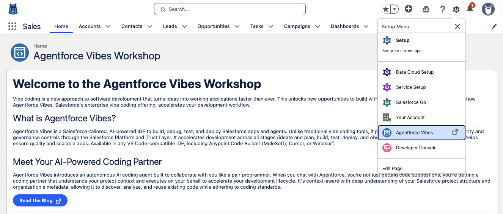
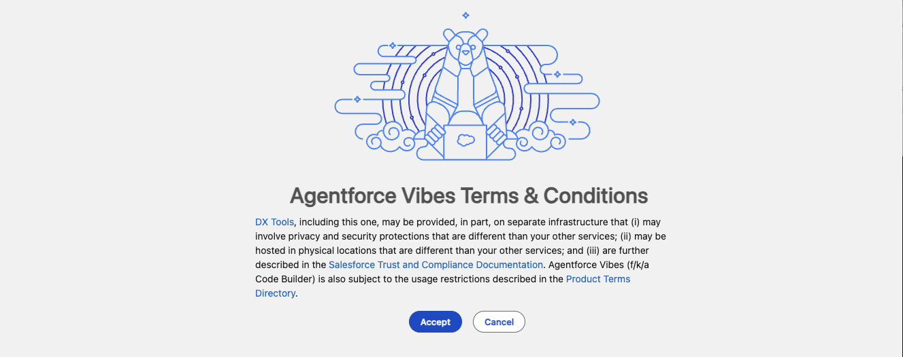
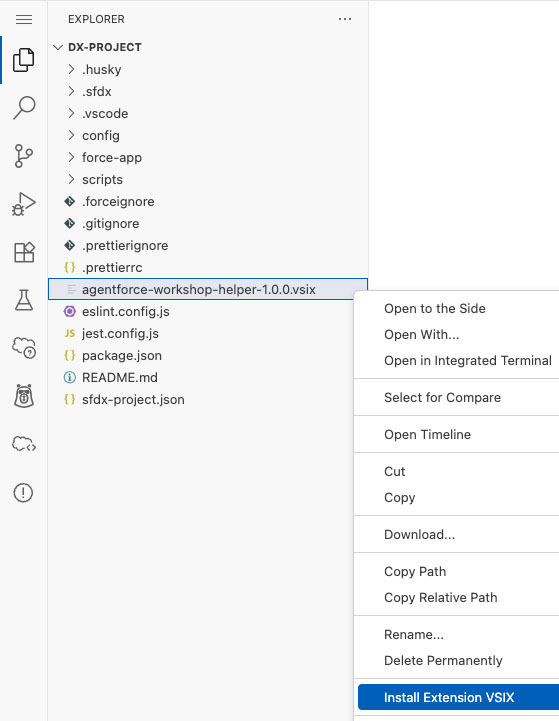
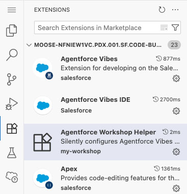
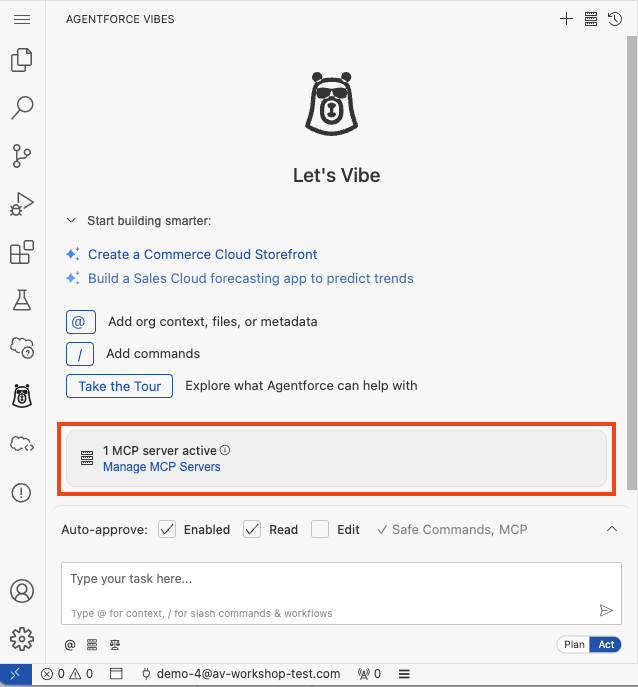
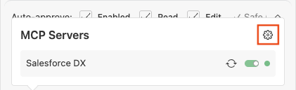
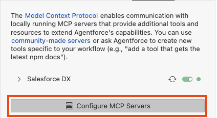
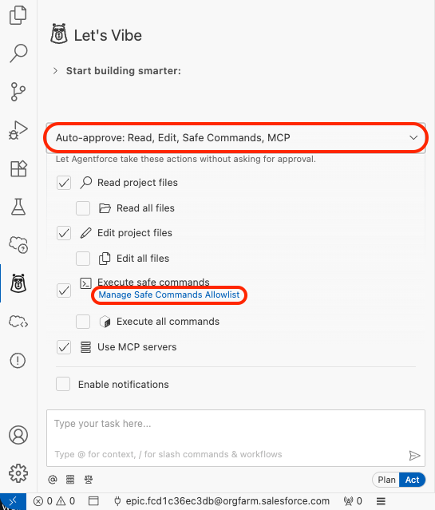

# Exercise 1: Launch and Configure Agentforce Vibes

<p align="center">
   <a href="../README.md">▲ Home</a>
   &nbsp;<b>|</b>&nbsp;
   <a href="2-vibe-code-a-component.md">Next Exercise ▶︎</a>
</p>

In this exercise, you'll launch Agentforce Vibes and configure it for the workshop.


## Step 1: Launch Agentforce Vibes IDE

1. Open the **Setup Menu** and click **Agentforce Vibes**.

   

1. Accept the **Terms and Conditions**.

   

> [!TIP]
> It will take a few minutes for Agentforce Vibes to fully initialize. A Salesforce DX project will be automatically created for you and your org will be authorized by default.

> [!TIP]
> You may see a large number of notifications in the bottom right of the IDE. This is where any IDE or Extension notifications will be published. You can close any that have appeared on launch.

3. The **Agentforce Sidebar** should be open by default, if it is not you can select the **Agentforce Vibes Icon** in the sidebar to open.

1. Select **I agree to the terms** and click **Enable and Start Building**.

   

## Step 2: Install the Workshop Helper Extension

1. Open the **Integrated Terminal** (press <kbd>CTRL</kbd> + <kbd>`</kbd> on both Mac and Windows)

1. Run the following command:

   ```shell
   curl -L -o agentforce-workshop-helper-1.0.0.vsix \
   "https://agentforce-vibes-workshop.s3.us-east-2.amazonaws.com/agentforce-workshop-helper-1.0.0.vsix"
   ```

1. Open the **Explorer Sidebar**.

1. Right-click on **agentforce-workshop-helper-1.0.0.vsix** and select **Install Extension VSIX**.

   

1. Open the **Extensions Sidebar** and check that the **Agentforce Workshop Helper** extension is installed:

   

## Step 3: Update the Salesforce DX MCP Servers

1. Open the **Agentforce Vibes Sidebar**.

1. Click **Manage MCP Server**.

   

1. Click the **Configuration Icon**.

   

1. Click **Configure MCP Servers** to open the configuration file (`a4d_mcp_settings.json`).

   

1. Replace the contents with the following:

   ```json
   {
     "mcpServers": {
       "https://github.com/salesforcecli/mcp": {
         "disabled": false,
         "type": "stdio",
         "timeout": 600,
         "command": "node",
         "args": [
           "/home/codebuilder/.local/share/code-server/User/globalStorage/salesforce.salesforcedx-einstein-gpt/MCP/a4d-mcp-wrapper.js",
           "@salesforce/mcp@latest",
           "--orgs",
           "ALLOW_ALL_ORGS",
           "--toolsets",
           "data,metadata,lwc-experts,aura-experts,code-analysis,users",
           "--tools",
           "run_apex_test",
           "--allow-non-ga-tools"
         ]
       }
     }
   }
   ```

> [!TIP]
> We have activated experimental MCP tools using the `--allow-non-ga-tools` flag. You can see all available MCP tools on the [Salesforce CLI](https://github.com/salesforcecli/mcp/blob/main/README.md#mcp-client-configurations) GitHub repository.


## Step 4: Configure safe commands

1. From the **Agentforce Vibes Sidebar**, click **Auto-approve: Read, Edit, Safe Commands, MCP**

1. Click **Manage Safe Command Allow List** to open the configuration file (`a4d_safe_commands`).

   

1. Paste the following lines at the end of the file:

   ```
   git status
   mkdir ...
   ls ...
   find ...
   head ...
   ```

---

<p align="center">
   <a href="../README.md">▲ Home</a>
   &nbsp;<b>|</b>&nbsp;
   <a href="2-vibe-code-a-component.md">▶︎ Next Exercise</a>
</p>
