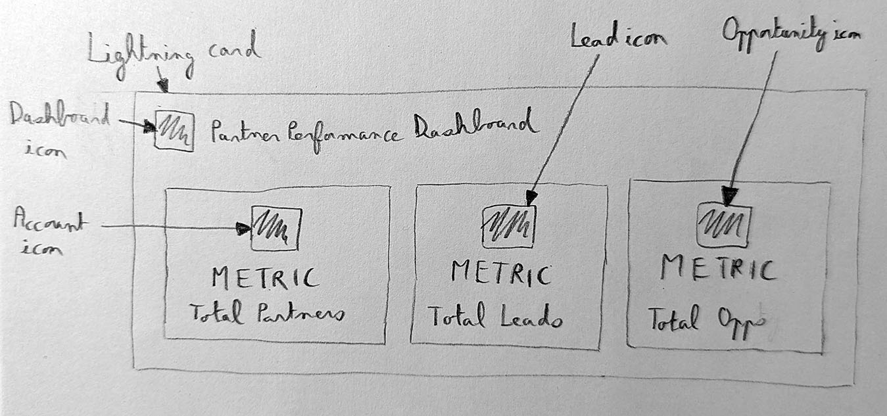
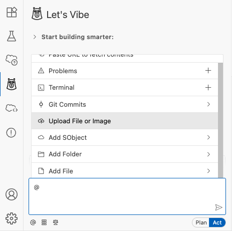
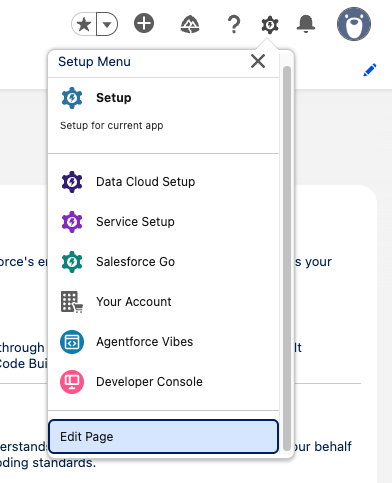
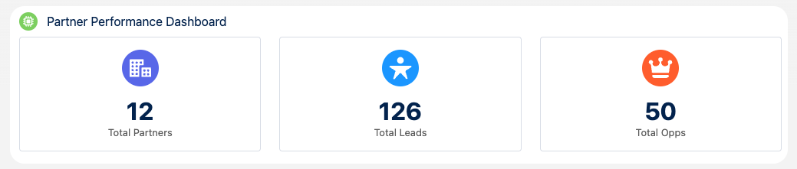

# Exercise 2: Vibe Code a Component

<p align="center">
   <a href="1-launch-and-setup.md">◀︎ Previous Exercise</a>
   &nbsp;<b>|</b>&nbsp;
   <a href="../README.md">▲ Home</a>
   &nbsp;<b>|</b>&nbsp;
   <a href="3-work-with-rules-workflows-skills.md">Next Exercise ▶︎</a>
</p>

---

In this exercise, you'll configure your Salesforce project to retrieve some context and vibe code a component with a multimodal prompt.

## Step 1: Retrieve the Org's Metadata

1. Open the **Terminal** (press <kbd>CTRL</kbd> + <kbd>`</kbd> on both Mac and Windows)

1. Run the following command:

   ```shell
   sf project retrieve start -m CustomObject:Account -m CustomObject:Lead -m CustomObject:Opportunity
   ```

   This command retrieves the metadata required for the project.

> [!IMPORTANT]
> Downloading the objects ensures Agentforce Vibes can analyze your org’s schema and accurately generate Apex and LWC code.

> [!TIP]
> As an alternative to the CLI you could also retrieve the metadata manually with the Org Explorer.

3. Confirm that your project's `force-app/main/default/objects` folder includes the **Account**, **Lead**, and **Opportunity** objects.

Your project is now fully configured with the metadata Agentforce Vibes needs to plan and generate the Partner Performance Dashboard.

## Step 2: Create a component with a multimodal prompt

In this step, we're going to use a multimodal prompt with an image to generate a component.

This is the hand drawn sketch that we'll use:

   

1. Run the following command in the terminal to retrieve the image file in your project:

   ```shell
   curl -L -o ui-sketch.jpg \
   "https://raw.githubusercontent.com/pozil/agentforce-vibes-advanced-workshop/main/assets/2-ui-sketch.jpg"
   ```

   Ensure that the `ui-sketch.jpg` file is saved at the root of your project.

> [!TIP]
> This step is specific to Agentforce Vibes IDE. With VS Code, the image can be located anywhere so you don't need to retrieve it in your project.

2. Type `@` in the Agentforce Vibes prompt input to open the context menu.

   

1. From the menu, click **Upload File or Image**.

1. Select the `ui-sketch.jpg` file at the root of your project.

1. Paste this prompt then hit <kbd>Enter</kbd>:

   ```
   Implement an LWC for our home page with the following UI.
   Replace the METRICS placeholders by actual numbers retrieved with Apex.
   Use the objects from the local project. Do not modify the objects' metadata.
   Don't specify form factors or CSS media rules.
   Skip tests.
   Deploy the changes when done.
   ```

> [!IMPORTANT]
> There is currently a bug in our integration with the Claude LLM when dealing with multimodal prompts. You may need to click "Retry" if you see errors.

6. When prompted to do so, approve the use of the `deploy_metadata` tool.

> [!INFO]
> This may happen more than once if the agent needs to make adjustments to the deploy parameters.

7. Once the deployment is complete. Open your org's home page.

1. Click the **Setup icon menu** then click **Edit Page**.

   

1. Scroll down to **Custom** components and drag and drop the `partnerPerformanceDashboard` component on top of the page.

1. Click **Save**.

1. Click the **back arrow** on top of the screen to return to your home page and admire your new dashboard.

   

---

<p align="center">
   <a href="1-launch-and-setup.md">◀︎ Previous Exercise</a>
   &nbsp;<b>|</b>&nbsp;
   <a href="../README.md">▲ Home</a>
   &nbsp;<b>|</b>&nbsp;
   <a href="3-work-with-rules-workflows-skills.md">Next Exercise ▶︎</a>
</p>
