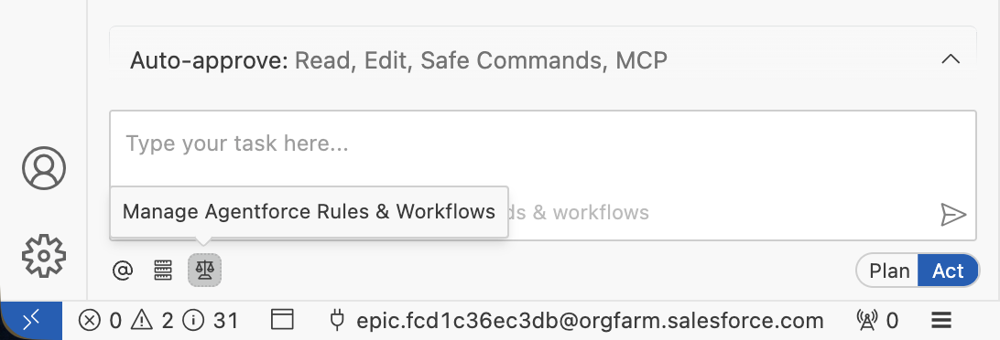

# Exercise 3: Work with Rules, Workflows and Skills

<p align="center">
   <a href="2-vibe-code-a-component.md">◀︎ Previous Exercise</a>
   &nbsp;<b>|</b>&nbsp;
   <a href="../README.md">▲ Home</a>
</p>

---

In this Exercise, you'll work with [Rules](https://developer.salesforce.com/docs/platform/einstein-for-devs/guide/devagent-rules.html), [Workflows](https://developer.salesforce.com/docs/platform/einstein-for-devs/guide/devagent-workflows.html) and [Skills](https://developer.salesforce.com/docs/platform/einstein-for-devs/guide/skills.html) to automate actions with Agentforce Vibes.

## Create a Rule

1. From the **Agentforce Vibes Sidebar**, click the **Manage Agentforce Rules & Workflows** (balance) icon:

   

1. Make sure that you're on the **Rules** tab.

1. Enter `custom-git-convention.md` under the **Workspace Rules** section.

1. Click **+** next to the text that you entered.

1. Paste the following text in the file:

   ```md
   # Git Conventions
   When asked to commit on git, creating issues or PRs, use conventional commit messages in the form of `<type>: <description>`.
   Where:
   - `type` is one of: `fix`, `feat`, `build`, `chore`, `ci`, `docs`, `style`, `refactor`, `perf`, `test`.
   - `description` is a short description of the changes introduced in the commit, a summary of the issue or the PR.
   ```

## Create a Workflow

Checkout out a feature branch, commit the current changes, push them to the remote. Create a PR.

## Create a Skill


---

<p align="center">
   <a href="2-vibe-code-a-component.md">◀︎ Previous Exercise</a>
   &nbsp;<b>|</b>&nbsp;
   <a href="../README.md">▲ Home</a>
</p>