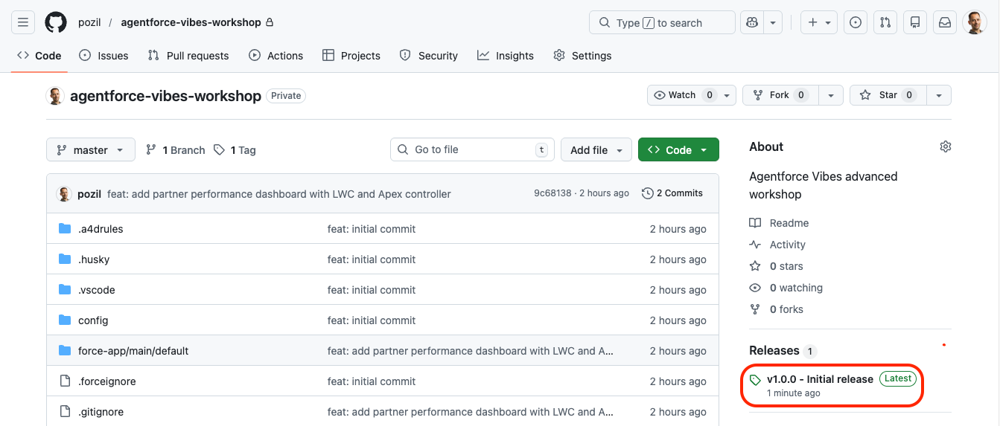
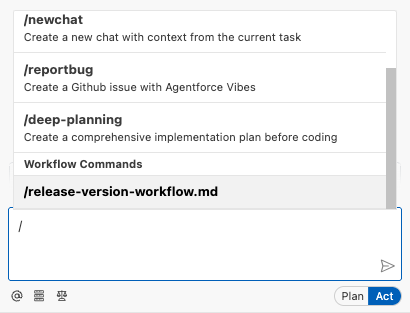
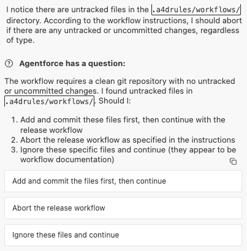

# Exercise 4: Work with Workflows

<p align="center">
   <a href="3-work-with-rules.md">◀︎ Previous Exercise</a>
   &nbsp;<b>|</b>&nbsp;
   <a href="../README.md">▲ Home</a>
</p>

---

In this exercise, you'll configure GitHub and create an [Agentforce Vibes Workflow](https://developer.salesforce.com/docs/platform/einstein-for-devs/guide/devagent-workflows.html) that automates project releases.


## Step 1: Authenticate with GitHub

1. Run this command in the terminal to authenticate with GitHub:

   ```shell
   gh auth login --git-protocol https --hostname github.com --web
   ```

2. Type `yes` to confirm the authentication request.
3. Copy the one-time code from the command's output.
4. Press <kbd>Enter</kbd>.
5. Click **Open** to allow the redirection to github.com.
6. On the GitHub page, paste the one-time code and click **Continue**.
7. Click **Authorize GitHub**.
8. If prompted, enter your GitHub credentials.
9. Close the GitHub page and go back to Agentforce Vibes IDE.
10. Ensure that the last command ended with something like:

   ```
   ✓ Authentication complete.
   - gh config set -h github.com git_protocol https
   ✓ Configured git protocol
   ! Authentication credentials saved in plain text
   ✓ Logged in as pozil
   ```

> [!TIP]
> You can run `gh auth status` to verify that you're correctly authenticated.


## Step 2: Create a GitHub repository with your project's content

1. Run this command in the terminal to create a private GitHub repository and push your project to it:

   ```shell
   gh repo create agentforce-vibes-workshop --private --push --source . --description "Agentforce Vibes advanced workshop"
   ```

2. Run this command to create an initial release of your project:

   ```shell
   gh release create 1.0.0 --title "v1.0.0 - Initial release" --generate-notes
   ```

3. Run this command to open your repository in a new browser tab and verify that your version is created:

   ```shell
   gh repo view --web
   ```

   The repository should look like this with the initial release:

   


## Step 3: Create a workflow to manage releases

1. From the **Agentforce Vibes Sidebar**, click the **Manage Agentforce Rules & Workflows** (balance) icon.

2. Click the **Skills** tab.

3. Enter `release-version-workflow.md` under the **Workspace Workflows** section.

4. Click **+** next to the text that you entered.

5. Paste [this content](https://raw.githubusercontent.com/pozil/agentforce-vibes-advanced-workshop/main/assets/release-version-workflow.md) in the workflow file:

6. Go to Agentforce Vibes prompts, type <kbd>/</kbd> then select `/release-version-workflow.md` under **Workflow Commands**

   

7. Type <kbd>Enter</kbd> to run the workflow.

> [!NOTE]
> For the sake of brevity we're creating a release that is identical to the initial release as we haven't committed content since the previous release."

> [!NOTE]
> You're not prompted for confirmation when the agent runs `git status` because we added the command to the safe list earlier.

8. The agent should detect that our workflow file is untracked by git and offer to halt the workflow's execution based on its instructions:

   
   
   The above options may vary due the nature of AI:
   - If possible, ask the agent to add and commit the files then resume the workflow.
   - Otherwise, follow these steps:
      1. abort the workflow
      1. run this command to commit and push the file:
         ```sh
         git commit --all --message "build: release workflow" && git push
         ```
      1. relaunch the workflow.

9. Click **minor** when the agent asks about the release type.

   The agent should identify the new version as `1.1.0`.

10. Enter `Automated release workflow` when the agent asks about the release title.

11. Allow the agent to:
   - edit `package.json`
   - run the `git add ...` command
   - run the `gh release create ...` command

12. Run this command to verify that the new version is created:

      ```shell
      gh release list
      ```

      The output should look like this:

      | TITLE | TYPE | TAG NAME | PUBLISHED |
      | --- | --- | --- | --- |
      | Automated release workflow | Latest | 1.1.0 | less than a minute ago |
      | v1.0.0 - Initial release | | 1.0.0 | about 42 minutes ago |


---

<p align="center">
   <a href="3-work-with-rules.md">◀︎ Previous Exercise</a>
   &nbsp;<b>|</b>&nbsp;
   <a href="../README.md">▲ Home</a>
</p>