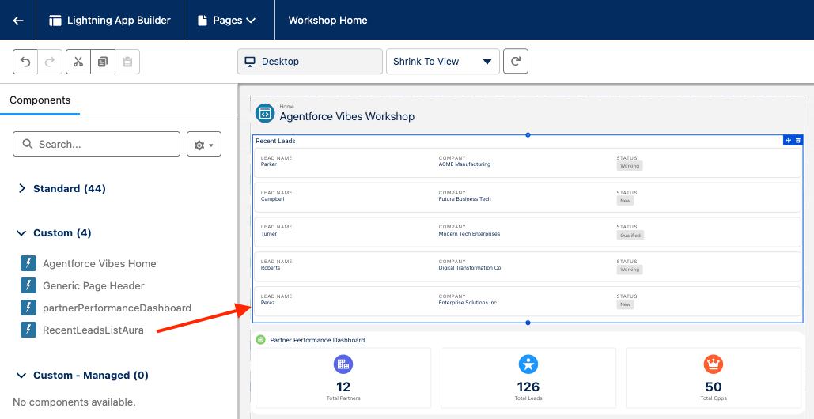

# Exercise 5: Migrate from Aura to LWC

<p align="center">
   <a href="4-work-with-workflows.md">◀︎ Previous Exercise</a>
   &nbsp;<b>|</b>&nbsp;
   <a href="../README.md">▲ Home</a>
</p>

---

In this exercise, you'll create an Aura component and migrate it to LWC with the Salesforce DX MCP tools.


## Step 1: Create an Aura component

1. Run the following prompt to create an Aura component:

   ```
   Create an "RecentLeadsListAura" Aura component that lists 5 recent lead records.
   Data is retrieved with a "RecentLeadsController" Apex controller.
   For each record, show the lead name, company and lead status.
   Clicking the lead name should open the lead record.
   
   Do not offer to create an LWC instead.
   Do not use the orchestrate_aura_migration tool.
   Do not create auradocs and svg files.
   Skip linting and tests.
   Deploy the metadata.
   ```

2. Open your org's home page.
3. Edit the page with Lightning App Builder.
4. Add the `RecentLeadsListAura` custom component to the top of the page and save it.

   


## Step 2: Migrate the Aura component to LWC

1. Run the following prompt to migrate the Aura component to LWC:

   ```
   Migrate the "RecentLeadsListAura" Aura component to LWC.
   Name the new LWC component "RecentLeadsListLWC" and add "(LWC)" to the component's title.
   
   Skip linting and tests.
   Only consider the "lightning__HomePage" target in the component's metadata.
   Ignore form factors or other target config.
   Deploy the metadata.
   ```

   You will need to approve the different tools that power the migration.

2. Open your org's home page.
3. Edit the page with Lightning App Builder.
4. Add the `RecentLeadsListLWC` custom component to the top of the page and save it.

   

   Compare your Aura and LWC components. They should look alike and carry the same functionalities.


---

<p align="center">
   <a href="4-work-with-workflows.md">◀︎ Previous Exercise</a>
   &nbsp;<b>|</b>&nbsp;
   <a href="../README.md">▲ Home</a>
</p>