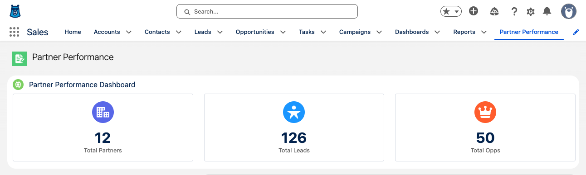

# Exercise 5: Work with Skills

<p align="center">
   <a href="4-work-with-workflows.md">◀︎ Previous Exercise</a>
   &nbsp;<b>|</b>&nbsp;
   <a href="../README.md">▲ Home</a>
   &nbsp;<b>|</b>&nbsp;
   <a href="6-migrate-from-aura-to-lwc.md">Next Exercise ▶︎</a>
</p>

---

In this exercise, you'll create an [Agentforce Vibes Skill](https://developer.salesforce.com/docs/platform/einstein-for-devs/guide/skills.html) that helps with editing Flexipage metadata.


## Step 1: Create a skill

1. From the **Agentforce Vibes Sidebar**, click the **Manage Agentforce Rules & Workflows** (balance) icon.

2. Click the **Skills** tab.

3. Enter `salesforce-flexipage` under the **Workspace Skills** section and click **+**.

4. Replace the entire content of the `SKILL.md` file with [this content](https://raw.githubusercontent.com/forcedotcom/afv-library/main/skills/salesforce-flexipage/SKILL.md).

> [!INFO]
> This skill is one of the many Agentforce Vibes Open Source resources available on the [Agentforce Vibes Library](https://github.com/forcedotcom/afv-library) GitHub repository.


## Step 2: Test your skill

1. Run the following prompt:

   ```
   Create a "Partner Performance" custom Lightning page tab with a new flexipage that holds the partnerPerformanceDashboard LWC.
   Add the tab to the "Partner Management" permission set.
   Deploy the metadata.
   ```

   Notice in the agent's response that the Flexipage skill is being used.

2. Open your Org's Setup.
3. Search for `App` and click **App Manager**.
4. Find the app with **LightningSales** as its Developer Name and edit it.
5. Click **Navigation Items**.
6. Search for `perf` and add the **Partner Performance** page to the Selected Item list.
7. Click **Save**.
8. Go back to the Sales app home page.

> [!NOTE]
> You may need to refresh the page a couple of times to see your new tab.

9. Click the **Partner Performance** tab.

   

> [!NOTE]
> The page may contain additional components that you can remove.


---

<p align="center">
   <a href="4-work-with-workflows.md">◀︎ Previous Exercise</a>
   &nbsp;<b>|</b>&nbsp;
   <a href="../README.md">▲ Home</a>
   &nbsp;<b>|</b>&nbsp;
   <a href="6-migrate-from-aura-to-lwc.md">Next Exercise ▶︎</a>
</p>